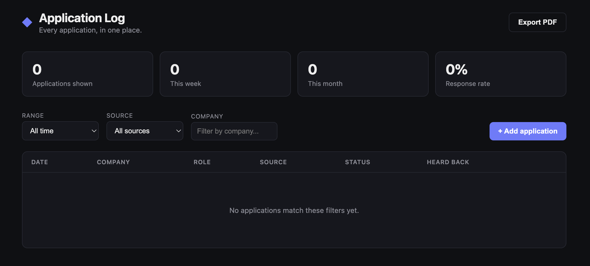

# JobLog — Chrome Job Application Tracker Extension

JobLog is a lightweight, local-first Chrome extension that automatically detects and tracks your job applications. It uses a proactive, live-updating floating widget on supported websites (LinkedIn, Indeed, Naukri, Glassdoor, Hirist) and a manual form for all other career sites.

All your application data is stored 100% locally in your browser's extension storage.

---

## Key Features

1. **Auto-Detect & Live Preview (Floating Widget):**
   When browsing job postings on supported websites, a small floating card appears in the bottom-right corner. It automatically grabs the **Company**, **Job Title**, and **Source**.
   - As you switch between different job listings, the widget dynamically updates with the new job's details.
   - If you want to keep the widget out of the way, click the minimize button (`─`) to collapse it into a tiny pulsing `◆` icon.
   - Simply click **"Save Application ✓"** on the widget when you submit your application.

2. **Manual Toolbar Popup:**
   For unsupported websites or direct company career pages, click the extension icon in your Chrome toolbar. The popup will open and pre-fill details if it detects any job information on the page, letting you manually customize and save the entry.

3. **Interactive Dashboard:**
   - **Modern Analytics UI:** Features a sleek dark-themed console showing statistics like total applications listed, applications submitted this week vs. this month, and your overall interview response rate.
   - **Filtered PDF Export:** Clicking the "Export PDF" button generates a clean, printable document that respects your current search filters (Date Range, Source, and Company). Only the applications matching your active filters will be exported to the PDF, allowing you to create custom reports (e.g., _Naukri applications this month_).
   - **Inline Edit & Delete:** Modify details or status (Applied, Interviewing, Offer, Rejected, Ghosted) directly on individual rows or delete entries with a single click.

---

## How to Install (Load Unpacked)

1. Download or clone this repository to a permanent folder on your computer. (Do not delete it after installing, as Chrome reads the extension files directly from this folder).
2. Open Google Chrome and navigate to `chrome://extensions`.
3. In the top-right corner, turn on **Developer mode** toggle.
4. Click the **Load unpacked** button in the top-left.
5. Select the `job-tracker-extension` directory.
6. The extension is now active! Pin it to your Chrome toolbar for easy access.

---

## Troubleshooting & Selector Limitations

> [!WARNING]
> Because job portals (especially LinkedIn and Glassdoor) update their page structures, layouts, and class names frequently:
>
> - **Wrong data/Missed details:** Sometimes the extension may grab wrong text (e.g., mixing up the company name and title) or fail to populate one of the fields automatically. You can edit the text directly in the floating widget or toolbar popup before clicking **Save**.
> - **Widget not appearing:** If the widget does not load, click the extension icon in your Chrome toolbar to enter the application details manually.

- Data is stored per-browser via `chrome.storage.local`. It won't sync to
  another browser or computer. If you switch machines, this history won't
  follow automatically.
- Uninstalling the extension will delete its local storage, so export a PDF
  backup periodically if the history matters to you.
# job-tracker-extensions
